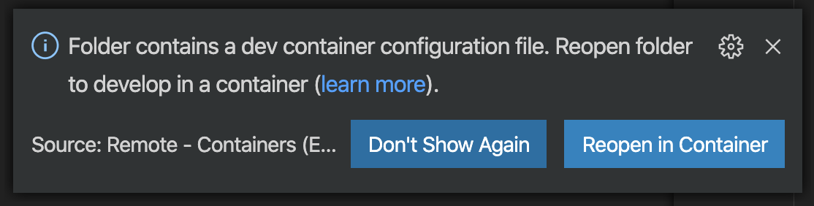
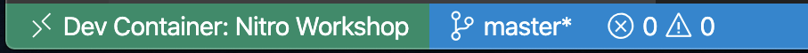

# 0. Prerequisites
## Install required tools

To follow this workshop, you need these to have these tools installed:

- A working [Node.js](https://nodejs.org) environment (latest LTS version recommended, **don't use v13**). If you use MacOS I suggest using [FNM](https://github.com/Schniz/fnm) to install Node.js instead of the package installer, to avoid permissions issues.
- The [Azure CLI](https://docs.microsoft.com/cli/azure/install-azure-cli?view=azure-cli-latest&WT.mc_id=nitro-workshop-yolasors&ocid=aid2462702_ThankYou_DevComm&eventId=SnowcampWorkshop__J-5rEio2r5p) to create resources on Azure. If you do not want to install it locally, you can use [shell.azure.com](https://shell.azure.com/?WT.mc_id=nitro-workshop-yolasors&ocid=aid2462702_ThankYou_DevComm&eventId=SnowcampWorkshop__J-5rEio2r5p).
- [Azure Functions Core Tools v2](https://docs.microsoft.com/azure/azure-functions/functions-run-local#v2?WT.mc_id=nitro-workshop-yolasors&ocid=aid2462702_ThankYou_DevComm&eventId=SnowcampWorkshop__J-5rEio2r5p) to test your functions locally.
- A code editor of your choice. If you don't have any code editor installed on your machine, you can install [Visual Studio Code](https://code.visualstudio.com?WT.mc_id=nitro-workshop-yolasors&ocid=aid2462702_ThankYou_DevComm&eventId=SnowcampWorkshop__J-5rEio2r5p).

### Alternative: using Docker and Visual Studio Code

If you have Docker and Visual Studio Code installed on your machine, you can use the [Remote Development extension](https://marketplace.visualstudio.com/items?itemName=ms-vscode-remote.vscode-remote-extensionpack&WT.mc_id=nitro-workshop-yolasors&ocid=aid2462702_ThankYou_DevComm&eventId=SnowcampWorkshop__J-5rEio2r5p) and a pre-made Docker image with everything needed installed.

1. Install the VS Code extension:
  ```
  code --install-extension ms-vscode-remote.vscode-remote-extensionpack
  ```
2. Unzip [this file](./devcontainer.zip) in your project folder
3. Open your project folder in VS Code, then click `Reload in container` when you see this popup:
   
4. Once the Docker image is built (it might take a few minutes), you should see this in the left part of the status bar
    

## Configure your Azure account

An Azure subscription is needed to create resources and deploy the application for this workshop.

If you don't have an account, you can [create one for free using this link](https://azure.microsoft.com/free/?WT.mc_id=nitro-workshop-yolasors&ocid=aid2462702_ThankYou_DevComm&eventId=SnowcampWorkshop__J-5rEio2r5p). It includes free credits, more than enough to cover usage for this workshop 😉.

### I have an Azure Pass

If you are participating in an event and you have an **Azure Pass**, follow these steps instead to create a new subscription.

Before starting, make sure that:
- You have a Microsoft account (formerly Live). You can create one on [account.microsoft.com](https://account.microsoft.com?WT.mc_id=nitro-workshop-yolasors&ocid=aid2462702_ThankYou_DevComm&eventId=SnowcampWorkshop__J-5rEio2r5p).
- Your account was never used for another Azure subscription. Otherwise, you won't be able to use the Azure Pass.

::: warning Important
If at some point during the registration process you are asked to provide your credit card information, something is not right. Ask help to one of the instructors.
:::

Open [this link](https://www.microsoftazurepass.com/Home/HowTo?Length=5&WT.mc_id=nitro-workshop-yolasors&ocid=aid2462702_ThankYou_DevComm&eventId=SnowcampWorkshop__J-5rEio2r5p) and follow the instruction steps. 

## Test your environment

Open up a terminal, then type these commands:
```
node -v
npm -v
az -v
```
If you see all the tools version printed in the console, you're ready to go! 🎉
