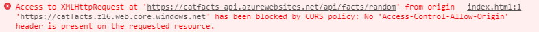

# 5. Extras

At this point, you already have a working full-featured serverless API, well done! 🎉

NestJS is a very comprehensive framework, and there could be a lot more use-cases to cover for your specific needs. I encourage you to dive into the [NestJS documentation](https://docs.nestjs.com/) to learn more about the techniques and tools you can use.

If you have more time and feel like it, here are some extras points that I found interesting to cover, especially if you want to build enterprise apps.

Note that each of these extra parts is entirely independent, so you can skip to the one you are the most interested in or do them in any order 😉.

## Add data validation

It is a best practice to check and validate any data received by an API.
What do you think would happen if you call your story creation endpoint, but without providing data?

Let's try!

```sh
curl http://localhost:7071/api/stories -X POST -d ""
```

Whoops! A new story is created, but with our entity properties are left empty 😱.

We might want to make sure a new story has its `animal` field set and either a `description` or an image provided.

Nest.js provides a built-in `ValidationPipe` that enforces validation rules for received data payloads, thanks to annotations provided by the [`class-validator`](https://github.com/typestack/class-validator) package.

To use it, you have to create a DTO ([Data Transfer Object](https://en.wikipedia.org/wiki/Data_transfer_object)) class on which you will declare the validations rules using annotations.

First, you need to install the required packages:

```sh
npm install class-validator class-transformer
```

Then create the file `src/stories/story.dto.ts`:

```ts
export class StoryDto {
  @IsNotEmpty()
  animal: string;
  
  @IsOptional()
  description: string;
  
  @IsOptional()
  createdAt: Date;
}
```

It looks like a lot like our `Story` entity, but this time you define only properties that are expected in the request payload. That's why there is no `imageUrl` property here: it will be set by the controller only if an image file is uploaded.

The annotations `@IsNotEmpty()` and `@IsOptional()` describe which property can be omitted and which one can be set in the payload. You can see the complete list of provided decorators [here](https://github.com/typestack/class-validator#validation-decorators).

Now open `src/stories/stories.controller.ts` and change the type of the `data` parameter of your `POST` function to `StoryDto`:

```ts
...
async createStory(
  @Body()
  data: StoryDto,
  @UploadedFile()
  file: UploadedFileMetadata,
): Promise<Story> {
...
```

Finally open `src/main.azure.ts` and enable `ValidationPipe` at the application level, to ensure all endpoints gets data validation:

```ts
const app = await NestFactory.create(AppModule);
app.setGlobalPrefix('api');
app.useGlobalPipes(new ValidationPipe());
```

Start your server with `npm run start:azure` and run the previous `curl` command again. This time you should properly receive an HTTP error `400` (bad request).

::: tip Pro tip
By default, detailed error messages will be automatically generated in case of a validation error. You also specify custom error message in the decorator options, for example:
```ts
@IsNotEmpty({ message: 'animal must not be empty' })
animal: string;
```
You also use special tokens in your error message or use a function for better granularity. See the [`class-validator` documentation](https://github.com/typestack/class-validator#validation-messages) for more details.
:::

What about our other constraint, which is to have either a `description` or an image file provided?

Since the `imageUrl` information is not directly part of the DTO, we cannot use it for validation. As the `imageUrl` property is set in the controller, that's where you have to perform manual validation. You can use the [manual validation methods](https://github.com/typestack/class-validator#manual-validation) of the `class-validator` package for that.

This time, it's your turn to finish the job!
- Ensure that either `description` or `imageUrl` is not empty, using manual validation.
- Ensure that `description` length is at most 240 characters.
- Ensure that `animal` is either set to `cat`, `doc` or `hamster` using annotations.
- Ensure that `createdAt` is a date if provided, using annotations.

You can read more on data validation techniques in the [NestJS documentation](https://docs.nestjs.com/techniques/validation).

## Enable CORS

If you try to access your API inside a web application from your browser, you might encounter an error like that one:



This error occurs because browsers block HTTP requests from scripts to web domains different than the one of the current web page to improve security.

To bypass this restriction, your server must define specific HTTP headers to allow it. This mechanism is called [Cross-Origin Resource Sharing](https://developer.mozilla.org/docs/Web/HTTP/CORS) (CORS).

CORS is already enabled by default on Azure Functions but you must add your website domain to the list of allowed origins using this command:

```
# Don't forget to change the name and URL with your own
$ az functionapp cors add \
    --name funpets-api \
    --resource-group funpets \
    --allowed-origins https://yourwebsite.com
```

If you want to allow any website to use your API, you can replace the website URL by using `*` instead. In that case, be careful as Azure Functions will auto-scale to handle the workload if millions of users start using it, but so will your bill!

## Enable authorization

By default, all Azure Functions triggered by HTTP are publicly available. It's useful for a lot of scenarios, but at some point you might want to restrict who can execute your functions, in our case your API.

Open the file `main/function.json`. In the functions, bindings, notice that `authLevel` is set to `anonymous`. It can be set to one of these 3 values:

- `anonymous`: no API key is required (default).
- `function`: an API key specific to this function is required. If none is defined, the `default` one will be used.
- `admin`: a host API key is required. It will be shared among all functions from the same app.

Now change `authLevel` to `function`, and redeploy your function:

```sh
# Don't forget to change the name with the one you used previously
func azure functionapp publish <your-funpets-api> --nozip
```

Then try to invoke again your API:

```sh
curl https://<your-funpets-api>.azurewebsites.net/api/stories -i
```

You should get an HTTP status `401` error (`Unauthorized`).

To call a protected function, you need to either provide the key as a query string parameter in the form `code=<api_key>` or you can provide it with the HTTP header `x-functions-key`.

You can either log in to [portal.azure.com](https://portal.azure.com?WT.mc_id=nitro-workshop-yolasors) and go to your function app, or follow these steps to retrieve your function API keys:

```sh
// Retrieve your resource ID
# Don't forget to change the name with the one you used previously
az functionapp show --name <your-funpets-api> \
                    --resource-group funpets \
                    --query id

# Use the resource ID from the previous command
az rest --method post --uri "<resource_id>/host/default/listKeys?api-version=2018-11-01"
```

You should see something like that:

```json
{
  "functionKeys": {
    "default": "functionApiKey=="
  },
  "masterKey": "masterApiKey==",
  "systemKeys": {}
}
```

Then try to invoke again your API, this time with the `x-functions-key` header set with your function API key:

```sh
curl https://<your-funpets-api>.azurewebsites.net/api/stories -i \
  -H "x-functions-key: <your_function_api_key>"
```

This time the call should succeed!

Using authorization level you can restrict who can call your API, this can be useful especially for service-to-service access restrictions.

However, if you need to manage finely who can access your API with an endpoint granularity, you need to implement [authentication](https://docs.nestjs.com/techniques/authentication) in your app.

<!-- ## Manage authentication
+ delete endpoints -->

<!--
## Integrate Swagger

[Swagger](https://swagger.io) is a widely used set of tools built around the [OpenAPI](https://swagger.io/specification/) specification. These tools allows you to:
- Provide a langage-agnostic definition of your REST APIs.
- Generate clients to consume your APIs in many languages
- Host an interactive UI to browse your APIs

NestJS provides a dedicated [module](https://github.com/nestjs/swagger) to integrate Swagger tools in your application with little effort.

First, install the required dependencies:

```sh
npm install --save @nestjs/swagger swagger-ui-express
```

Then open `src/main.azure.ts` to add Swagger initialization when your application starts:

```ts
import { INestApplication } from '@nestjs/common';
import { NestFactory } from '@nestjs/core';
import { SwaggerModule, DocumentBuilder } from '@nestjs/swagger';
import { AppModule } from './app.module';

export async function createApp(): Promise<INestApplication> {
  const app = await NestFactory.create(AppModule);
  app.setGlobalPrefix('api');

  const options = new DocumentBuilder()
    .setTitle('Funpets API')
    .setDescription('Manage fun pets stories and pictures')
    .setVersion('1.0')
    .addTag('stories')
    .build();
  const document = SwaggerModule.createDocument(app, options);
  SwaggerModule.setup('swagger', app, document);

  await app.init();
  return app;
}
```

The `DocumentBuilder` creates the base OpenAPI specification for you application.
It provides methods to set the title, description and version of your API. You also need to use the `addTag()` method to define which part of your API you want to document.

Then after the document is created, the `setup()` method will mount the [Swagger UI](https://swagger.io/tools/swagger-ui/) at the path specified, in this case `/api/swagger`.

Now start your server:

```sh
npm run start:azure
```

Keep your server running and open your browser to `http://localhost:7071/api/swagger`. You should see something like this:

TODO: pro tip JSON, add manual docs
 -->


## Write tests

Your API might currently look fine, but how can you ensure it has as little bugs as possible, and that you won't introduce regression in the future?

Writing automated is not the most fun part of development, but it's a fundamental requirement to develop robust software applications. It helps to catch bugs early, preventing regressions and ensuring that production releases meet your quality and performance goals.

The good news is NestJS has you covered to make your testing experience as smooth as possible.
When you bootstrapped the project using the `nest` CLI, [Jest](https://jestjs.io) and [SuperTest](https://github.com/visionmedia/supertest) frameworks have been set up for you.

Each time you run the `nest generate` command, unit test files are also created for you with the extension `.spec.ts`.

There are 5 NPM scripts dedicated to testing in your `package.json` file:
- `npm test`: runs unit tests once.
- `npm run test:watch` runs unit tests in watch mode, it will automatically re-run tests as you make modifications to the files. It is suited perfectly for [TDD](https://en.wikipedia.org/wiki/Test-driven_development).
- `npm run test:cov` runs unit tests and generate coverage report, so you can know which code paths are covered by your tests.
- `npm run test:debug`: runs unit tests with Node.js debugger enabled, so you can add breakpoints in your code editor and debug your tests more easily.
- `npm run test:e2e`: runs your end-to-end tests.

Now run the `npm test` command. Oops, it seems that `src/stories/stories.controller.spec.ts` test if failing 😱!

### Add module and providers mocks

If you look at the stack trace, you can see that the reason is that `@nestjs/typeorm` and `AzureStorageModule` services cannot be resolved. It's expected: when running unit tests, you want to isolate the code you are testing as much as possible, and for that you can see that each test file provides its own module definition:

```ts
beforeEach(async () => {
  const module: TestingModule = await Test.createTestingModule({
    controllers: [StoriesController],
  }).compile();

  controller = module.get<StoriesController>(StoriesController);
});
```

The module created with `Test.createTestingModule` does not import `AzureTableStorageModule` and `AzureStorageModule`, so that's why their providers cannot be resolved. Instead of importing them right away to fix the issue, we should write [**mocks**](https://en.wikipedia.org/wiki/Mock_object) for the providers we use instead.

#### Mock `@nestjs/azure-storage`

Let's start with mocking what we use in `@nestjs/azure-storage` module, using `jest.mock(<module>)` helper function. Add this code just after the imports:

```ts
jest.mock('@nestjs/azure-storage', () => ({
  // Use Jest automatic mock generation
  ...jest.genMockFromModule('@nestjs/azure-storage'),

  // Mock interceptor
  AzureStorageFileInterceptor: () => ({
    intercept: jest.fn((context, next) => next.handle())
  })
}));
```

For simple modules, using `jest.mock(<module>)` would be enough to generate mocks automatically according to the module interface.

But in our case, `AzureStorageFileInterceptor` needs to be mocked manually as it is a bit trickier: it must returns an object with a method `intercept(context, next)` that needs to call `next.handle()` to not break the chain of interceptors calls.

So we provide our own version of the `@nestjs/azure-storage` module mock, using `jest.genMockFromModule(<module>)` helper to automatically generates mocks for everything except `AzureStorageFileInterceptor`.

For `AzureStorageFileInterceptor` we manually reproduce a minimal implementation. Using `jest.fn()` method here creates a [mock function](https://jestjs.io/docs/en/mock-function-api). Thanks to that, we can later change its implementation in a specific test if needed.

Then add `AzureStorageService` to the testting module `providers` list:

```ts
beforeEach(async () => {
  const module: TestingModule = await Test.createTestingModule({
    controllers: [StoriesController],
    providers: [AzureStorageService]
  }).compile();

  controller = module.get<StoriesController>(StoriesController);
});
```

And complete the missing import:

```ts
import { AzureStorageService } from '@nestjs/azure-storage';
```

#### Mock `@nestjs/typeorm`

We also need to mock the `storiesRepository` service injected in our controller using `@InjectRepository(Story)`, but how to do that?

This time we do not need to mock the entire module, but only this specific service.
We can still use Jest automatic mock generation:

```ts
// Add this code after the imports
const mockRepository = jest.genMockFromModule<any>('typeorm').MongoRepository;
```

Its injection token is generated dynamically, so we need to add a [custom provider](https://docs.nestjs.com/fundamentals/custom-providers#custom-providers-1) to our testing module to reproduce the same behavior:

```ts
beforeEach(async () => {
  const module: TestingModule = await Test.createTestingModule({
    controllers: [StoriesController],
      providers: [
        AzureStorageService,
        { provide: getRepositoryToken(Story), useValue: mockRepository },
      ],
  }).compile();

  controller = module.get<StoriesController>(StoriesController);
});
```

::: tip Pro tip
We had to look at the implementation `@InjectRepository()` annotation to find out that it uses the method `getRepositoryToken()` internally. Unfortunately, that's something you have to do sometimes to be able to mock modules properly.
:::

Don't forget to add missing imports:

```ts
import { getRepositoryToken } from '@nestjs/typeorm';
import { Story } from './story.entity';
```

Now run `npm test` again, this time the tests should succeed!

### Complete test suite

Hold on, now that we have solved the mock issue, it's time to write more tests 😃!

Try to add:
- Unit tests for your controller in `src/stories/stories.controller.ts`.
- An end-to-end for of your endpoints in `tests/app.e2e-spec.ts`.

Take also a look a the report generated by `npm run test:cov` to see your test coverage.

If you are not familiar with Jest you might want to take a look at the [documentation](https://jestjs.io/docs/en/using-matchers).
For end-to-end tests, HTTP assertions are made using the [SuperTest library](https://github.com/visionmedia/supertest).

You can also find examples and more information in the [NestJS documentation](https://docs.nestjs.com/fundamentals/testing#unit-testing).

<br>

-----
**Solution:** see the [code for extras](https://github.com/nitro-stack/nitro-workshop/tree/step5)